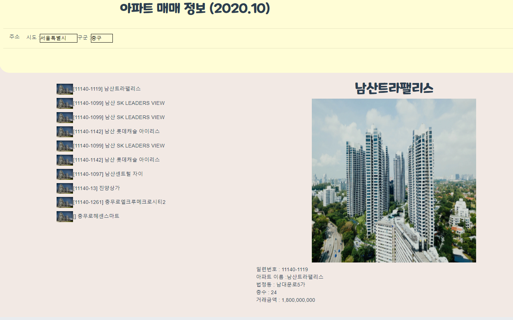
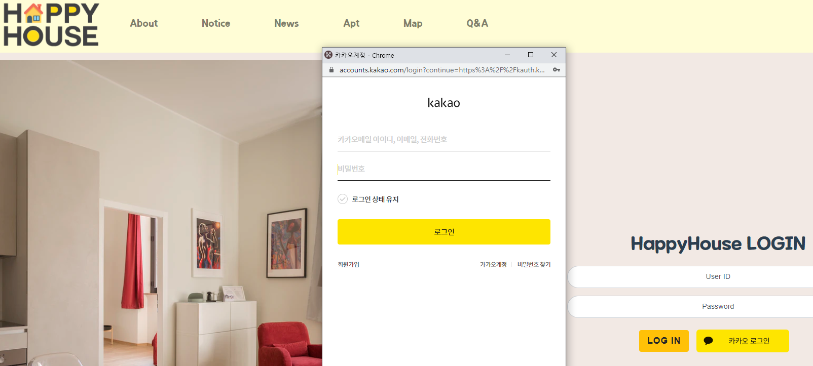
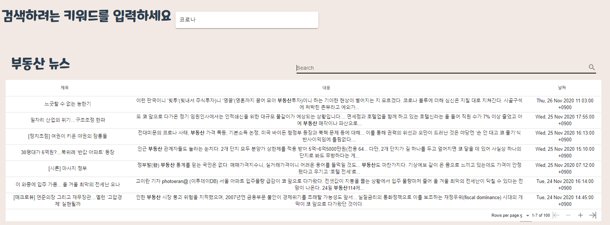
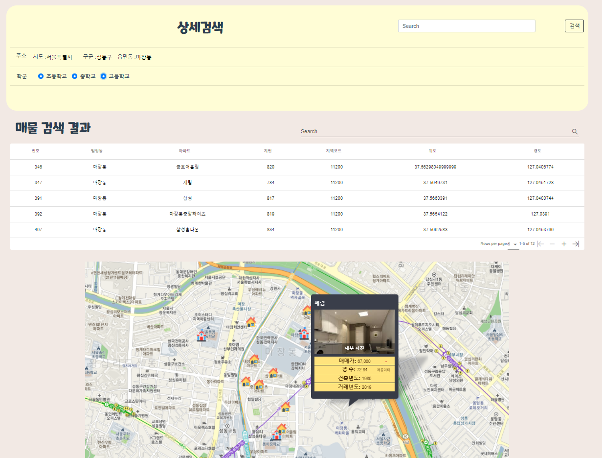
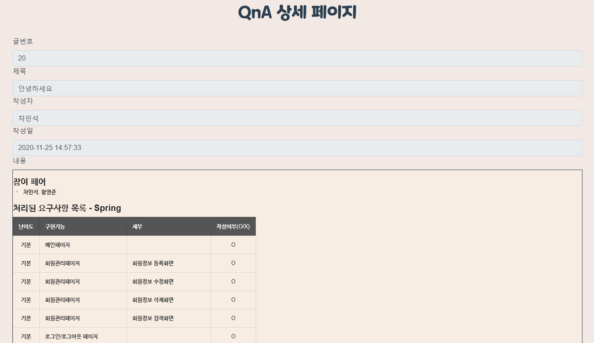
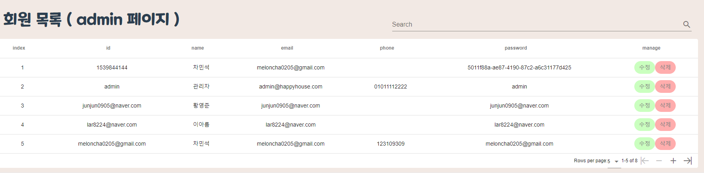

# HappyHouse*V2

### 

### 참여자

- 차민석, 황영준

  

### 실행화면 -

#### 매매정보

- 특정 지역의 부동산 매매 정보를 알고 싶은 사용자는 상단의 apt 메뉴를 클릭하여 매매 정보 페이지로 이동할 수 있습니다. 그리고 매매 정보를 알고 싶은 지역을 선택한 후 아파트를 클릭하면 해당 지역의 아파트 매매정보를 확인할 수 있습니다.
  

#### 소셜로그인

- 번거로운 회원가입 절차를 싫어하는 사용자는 HAPPYHOUSE에서 제공하는 소셜 로그인 기능을 이용하여 회원가입 절차없이 간편하게 로그인하여 서비스를 이용하실 수 있습니다.
  

#### 부동산 뉴스

- 다양한 부동산 뉴스를 한눈에 보고 싶은 사용자는 신문사별 뉴스를 찾아다닐 필요 없이 HAPPYHOUSE에서 제공하는 부동산 뉴스 페이지에서 키워드 검색을 통해 뉴스 정보를 조회 할 수 있습니다. 또한 뉴스 제목을 클릭 시 해당 뉴스기사 페이지로 이동하여 보다 자세한 정보를 얻을 수 있습니다.

#### 부동산 지도

- 해당 지역의 학군과 부동산 정보를 함께 확인하고 싶은 사용자는 지도 검색 페이지의 지역 검색을 통해 해당 지역의 부동산 매매 정보를 확인하고 학군 검색을 통해 해당지역의 학교를 확인 하여 학군의 형성 여부를 확인할 수 있습니다.
  

#### QnA 페이지

- QNA, 공지사항과 같은 관리자와 소통이 가능한 서비스를 원하는 사용자는 마크다운 언어를 이용한 작성 기능을 제공하는 QNA 페이지를 통해 관리자에게 문의사항을 남길 수 있고 관리자는 이에 답변을 남길 수 있습니다. 그리고 관리자는 공지사항에 HAPPYHOUSE 서비스에 관련된 공지사항을 게시할 수 있습니다.

#### 회원 관리페이지

- 서비스를 이용하는 사용자의 관리를 인터페이스 상에서 쉽게 하고싶은 관리자는 관리자 계정으로 HAPPYHOUSE에 로그인하여 회원 정보를 인터페이스 상에서 관리할 수 있습니다.
  

